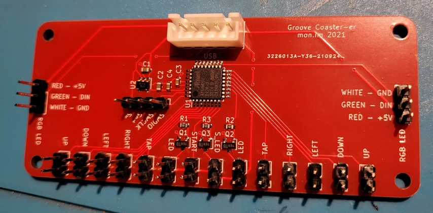

# Genbu Groove Coaster alternative PCB + firmware

Let's face it, the stock PCB is terrible. Totally impossible to modify, laggy,
boring.

This is one of many replacement PCBs for the Genbu con, using an ATSAMD21E17A-A.
It's a cheap ARM M0+ core from Microchip.
This particular chip is supported in the Arduino toolchain using MattairTech's
Arduino cores.

**The firmware does not support the Nintendo Switch** at the moment, but it
looks pretty simple to implement, so don't let that dissuade you if you're an
aspiring hacker.

Because my controller did not come with lights for the buttons (only for the
joystick), that's all the firmware does at the moment.

# Manufacture/soldering
I ordered a stencil + PCB from JLCPCB for ~$20 delivered (see the
groovin/gerbers folder, or use KiCad 6+ to generate them yourself), and use a $5
toaster oven I bought at a thrift shop to reflow solder the parts using Chip
Quik solder paste that I purchase from Digikey (along with all the other parts).
The switch connectors are all standard 2.54mm headers I cut into 2-pin units,
the resistors and capacitors I take from my 0603 resistor/capacitor book from
AliExpress.

The 3.3v regulator is not particularly exciting, as long as the pinout matches,
it should work fine.

**Ignore the picture** for the WS2812 headers, they should be female to properly
plug in to the Genbu LED connectors. I replaced the pins shortly after taking
the photo.

# Bootloader flashing
With my FT4232 breakout board, I used OpenOCD to flash the generic SAMD21
bootloader (included in this repository). I created a file called `post.cfg`
that reduced the adapter speed because I had some issues. Its entire contents
are `adapter speed 50`. I then ran `.\openocd.exe -f openocd.cfg -f
target/at91samdXX.cfg -f post.cfg`, connected via telnet, and executed `program
../sam_ba_Generic_x21E_SAMD21E17A.bin verify reset`.

# Firmware flashing
Once the bootloader is flashed, add the MattairTech board URL to your Arduino
install:  
`https://www.mattairtech.com/software/arduino/package_MattairTech_index.json`

Then select 
- Board: MattairTech MT-D21E Rev B (SAM D21/L21/C21, 32-pin)
- Microcontroller: SAMD21E17A
- Clock source: INTERNAL_USB_CALIBRATED_OSCILLATOR
- USB config: CDC_HID

Pin config is literally just digital pin 0-31 == PA0-PA31 -  SAMD is pretty nice!
